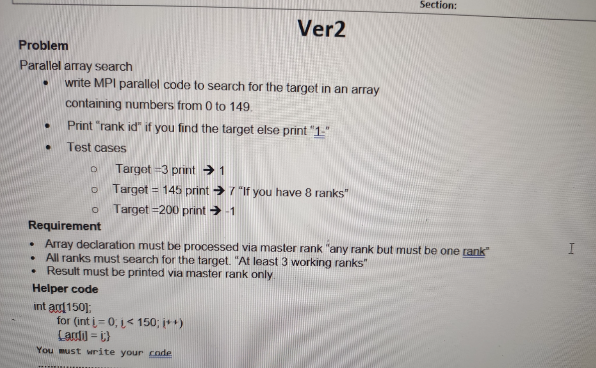
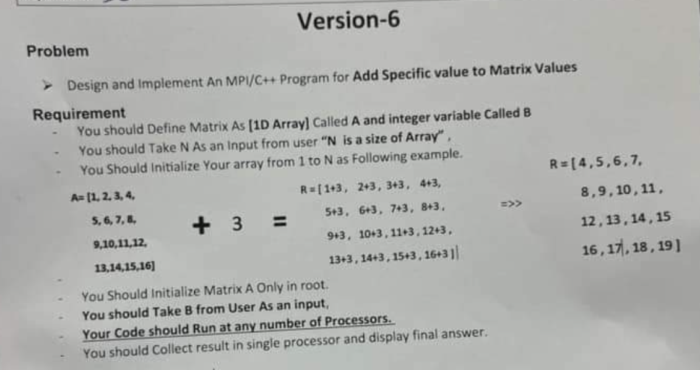

<div align=left>
<h1>
  HPC 'Practical Exams' Solutions
</h1>
  <h5>
    "High Performance Computing" course at FCIS - ASU
</div>
<br>

## Some Practical Exams with their solutions

Here he want me to print the result of the Standard Deviation based on this formula.


<b>Solution :<b>

```C++
#include <iostream>
#include <mpi.h>
#include <cmath>

using namespace std;

double calculateMean(double* array, int size)
{
    double sum = 0;

    for (int i = 0; i < size; i++)
        sum += array[i];

    return sum / size;
}

double calculateLocalSum(double* array, int size, double mean)
{
    double localSum = 0;

    for (int i = 0; i < size; i++)
        localSum += (array[i] - mean) * (array[i] - mean);

    return localSum;
}

int main()
{
    MPI_Init(NULL, NULL);

    int size, rank;
    MPI_Comm_size(MPI_COMM_WORLD, &size);
    MPI_Comm_rank(MPI_COMM_WORLD, &rank);

    double N = 150;
    double* X = nullptr;
    double mean = 0;
    double localSum = 0;
    double globalSum = 0;
    double standardDeviation = 0;

    if (rank == 0) {
        // Only the root process initializes the array
        X = new double[N];
        for (int i = 0; i < N; i++) {
            X[i] = i + 1;
            mean += X[i];
        }
        mean /= N;
    }

    // Broadcast the mean to all processes
    MPI_Bcast(&mean, 1, MPI_DOUBLE, 0, MPI_COMM_WORLD);

    // Calculate the local sum of squared differences from the mean
    int localSize = N / size;
    double* localX = new double[localSize];
    MPI_Scatter(X, localSize, MPI_DOUBLE, localX, localSize, MPI_DOUBLE, 0, MPI_COMM_WORLD);
    localSum = calculateLocalSum(localX, localSize, mean);
    delete[] localX;

    // Reduce the local sums to the root process
    MPI_Reduce(&localSum, &globalSum, 1, MPI_DOUBLE, MPI_SUM, 0, MPI_COMM_WORLD);

    if (rank == 0)
    {
        // Perform the final calculations on the root process
        for (int i = size * localSize; i < N; i++)
            globalSum += (X[i] - mean) * (X[i] - mean);

        // Calculate the standard deviation
        standardDeviation = sqrt(globalSum / (N - 1));

        // Print the result
        cout << "Standard Deviation: " << standardDeviation << endl;

        // Deallocate memory
        delete[] X;
    }

    MPI_Finalize();
    return 0;
}
```

<br>
<p align = 'center'>~~~~~~~~~~~~~~~~~~~~~~~~~~~~~~~~~~~~~~~~~~~~~~~~~~~~~~~~~~<p>
<br>


<b>Solution :<b>

```C++
#include <iostream>
#include <mpi.h>

using namespace std;

int main()
{
    //On 4 processors 
    MPI_Init(NULL, NULL);

    int rank;
    MPI_Comm_rank(MPI_COMM_WORLD, &rank);


    int arr[200], recvarr[50], processors[4];

    if (rank == 0)
        for (int i = 0; i < 200; i++)
            arr[i] = i + 1;

    MPI_Scatter(arr, 50, MPI_INT, recvarr, 50, MPI_INT, 0, MPI_COMM_WORLD);

    int max = 0;

    for (int i = 0; i < 50; i++)
        if (recvarr[i] > max)
            max = recvarr[i];


    MPI_Gather(&max, 1, MPI_INT, processors, 1, MPI_INT, 0, MPI_COMM_WORLD);

    int final_max = 0;

    if (rank == 0)
    {
        for (int i = 0; i < 4; i++)
            if (processors[i] > final_max)
                final_max = processors[i];

        cout << "Max number in the array is : " << final_max << endl;
    }

    MPI_Finalize();
    return 0;
}
```

<br>

3. <b>MPI Array Calculation<b>
This program performs a calculation on a given 4x4 array. The array is initially defined as follows:
```C++
[
  4,4,4,4
  6,6,6,6
  0,0,0,0
  1.3, 1.3, 1.3 1.3
]
```

The calculation is performed on each row of the array, using a value provided by the user. The specific operation to be applied on each row is as follows:

- Addition (`+`) on the first row
- Multiplication (`*`) on the second row
- Subtraction (`-`) on the third row
- Division (`/`) on the fourth row

For example, let's assume the user enters the value 3. The result of the calculation will be a modified array:

```C++
[ 4, 4, 4, 4,
  6, 6, 6, 6,
  0, 0, 0, 0,
  1.3, 1.3, 1.3, 1.3]
```
Now, let's take a look at the solution.

<b>Solution:<b>

```C++
#include <iostream>
#include <stdio.h>
#include <cmath>
#include "math.h"
#include <mpi.h>

using namespace std;

int main(int argc, char** argv)
{
    MPI_Init(NULL, NULL);

    int size, rank;
    MPI_Comm_size(MPI_COMM_WORLD, &size);
    MPI_Comm_rank(MPI_COMM_WORLD, &rank);

    //On 4 processors

    float B = 0;
    float arr[16] = { 1,1,1,1,2,2,2,2,3,3,3,3,4,4,4,4 };
    float recv_arr[4];

    if (rank == 0)
    {
        cout << "Please enter the number" << endl;
        cin >> B;
    }

    MPI_Bcast(&B, 1, MPI_FLOAT, 0, MPI_COMM_WORLD);
    MPI_Scatter(arr, 4, MPI_FLOAT, recv_arr, 4, MPI_FLOAT, 0, MPI_COMM_WORLD);


    for (int i = 0; i < 4; i++)
    {
        if (rank == 0)
            recv_arr[i] += B;
        else if (rank == 1)
            recv_arr[i] *= B;
        else if (rank == 2)
            recv_arr[i] -= B;
        else if (rank == 3)
            recv_arr[i] /= B;
    }

    float final_result[16];
    MPI_Gather(recv_arr, 4, MPI_FLOAT, final_result, 4, MPI_FLOAT, 0, MPI_COMM_WORLD);

    if (rank == 0)
    {
        cout << "The matrix result is : \n";

        for (int i = 0; i < 16; i++)
        {
            cout << final_result[i] << setprecision(1) << endl;
        }
    }

    MPI_Finalize();
    return 0;
}
```

<br>

4. 


<b>Solution :<b>

```C++
#include <iostream>
#include <mpi.h>
#include <stdio.h>

using namespace std;

int main(int argc, char** argv)
{
	MPI_Init(NULL, NULL);
	int size, rank;
	MPI_Comm_size(MPI_COMM_WORLD, &size);
	MPI_Comm_rank(MPI_COMM_WORLD, &rank);

	int arr[150];
	if (rank == 0)
	{
		for (int i = 0; i < 150; i++)
		{
			arr[i] = i + 1;
		}
	}


	int processors[3] = { 0,0,0 };
	int localCount = 0;
	int local_arr[50];
	int generalCount = 0;

	MPI_Scatter(&arr, 50, MPI_INT, &local_arr, 50, MPI_INT, 0, MPI_COMM_WORLD);

	for (int j = 0; j < 50; j++)
	{
		if (local_arr[j] % 7 == 0)
			localCount++;
	}

	//MPI_Gather(&localCount, 1, MPI_INT, processors, 1, MPI_INT, 0, MPI_COMM_WORLD);
	MPI_Reduce(&localCount, &generalCount, 1, MPI_INT, MPI_SUM, 0, MPI_COMM_WORLD);

	if (rank == 0)
	{
		/*for (int j = 0; j < 3; j++)
			generalCount += processors[j];*/

		printf("The count of numbers divided by 7 is : %d", generalCount);

	}


	MPI_Finalize();
	return 0;
}
```

<br>

5. 



<b>Solution :<b>

```C++
#include <iostream>
#include <mpi.h>
#include <stdio.h>
#include <math.h>

using namespace std;

int main(int argc, char** argv)
{
    //On 3 processors "-n 3"
    MPI_Init(NULL, NULL);

    int size, rank;
    MPI_Comm_size(MPI_COMM_WORLD, &size);
    MPI_Comm_rank(MPI_COMM_WORLD, &rank);

    int arr[150];
    int N;

    if (rank == 0)
    {
        for (int i = 0; i < 150; i++)
            arr[i] = i;

        printf("Enter the N\n");
        cin >> N;
    }

    MPI_Bcast(&N, 1, MPI_INT, 0, MPI_COMM_WORLD);

    int recvbuf[50];

    MPI_Scatter(arr, 50, MPI_INT, recvbuf, 50, MPI_INT, 0, MPI_COMM_WORLD);


    int found = 0;
    int The_rank = 0;
    int x = 1;

    for (int i = 0; i < 50; i++)
    {
        if (N == recvbuf[i])
        {
            if (rank == 0)
                x = 0;
            found = rank;
        }
    }

    MPI_Reduce(&found, &The_rank, 1, MPI_INT, MPI_SUM, 0, MPI_COMM_WORLD);

    if (rank == 0)
    {
        if (The_rank != 0 || x == 0)
            printf("The rank is : %d", The_rank);
        else
            printf("-1");
    }


    MPI_Finalize();
    return 0;
}
```

<br>

6. 


<b>Solution :<b>

```C++
#include <iostream>
#include <stdio.h>
#include <mpi.h>

using namespace std;

int main(int argc, char** argv)
{
    MPI_Init(NULL, NULL);

    int size, rank;
    MPI_Comm_rank(MPI_COMM_WORLD, &rank);
    MPI_Comm_size(MPI_COMM_WORLD, &size);

    int arr[1000];
    int localarr[250];
    int loaclsum = 0;
    int sum = 0;


    if (rank == 0)
        for (int i = 0; i < 1000; i++)
            arr[i] = i + 1;

    //On 4 processors
    MPI_Scatter(&arr, 250, MPI_INT, &localarr, 250, MPI_INT, 0, MPI_COMM_WORLD);

    for (int i = 0; i < 250; i++)
    {
        if (localarr[i] % 2 == 0)
            loaclsum += localarr[i] + 2;
        else
            loaclsum += localarr[i] - 1;
    }


    MPI_Reduce(&loaclsum, &sum, 1, MPI_INT, MPI_SUM, 0, MPI_COMM_WORLD);

    if (rank == 0)
        printf("%d\n", sum);


    MPI_Finalize();
    return 0;
}
```

<br>

7.



<b>Solution :<b>

```C++
#include <iostream>
#include <stdio.h>
#include <mpi.h>

using namespace std;

int main(int argc, char** argv)
{
    //Run on number of the processors that divide the value of N only

    MPI_Init(NULL, NULL);

    int rank, size;
    MPI_Comm_rank(MPI_COMM_WORLD, &rank);
    MPI_Comm_size(MPI_COMM_WORLD, &size);

    int N, B;

    if (rank == 0)
    {
        cout << "Please enter N : " << endl;
        cin >> N;

        cout << "Please enter B : " << endl;
        cin >> B;
    }

    MPI_Bcast(&N, 1, MPI_INT, 0, MPI_COMM_WORLD);
    MPI_Bcast(&B, 1, MPI_INT, 0, MPI_COMM_WORLD);

    int* arr = new int[N];
    int* recv_arr = new int[N / size];

    if (rank == 0)
        for (int i = 0; i < N; i++)
            arr[i] = i + 1;


    MPI_Scatter(arr, (N / size), MPI_INT, recv_arr, (N / size), MPI_INT, 0, MPI_COMM_WORLD);


    for (int i = 0; i < N / size; i++)
    {
        recv_arr[i] += B;
    }

    int* final_result = new int[N];

    MPI_Gather(recv_arr, (N / size), MPI_INT, final_result, (N / size), MPI_INT, 0, MPI_COMM_WORLD);

    if (rank == 0)
    {
        cout << "The matrix result is : \n";

        for (int i = 0; i < N; i++)
        {
            cout << final_result[i] << endl;
        }
    }

    MPI_Finalize();
    return 0;
}
```